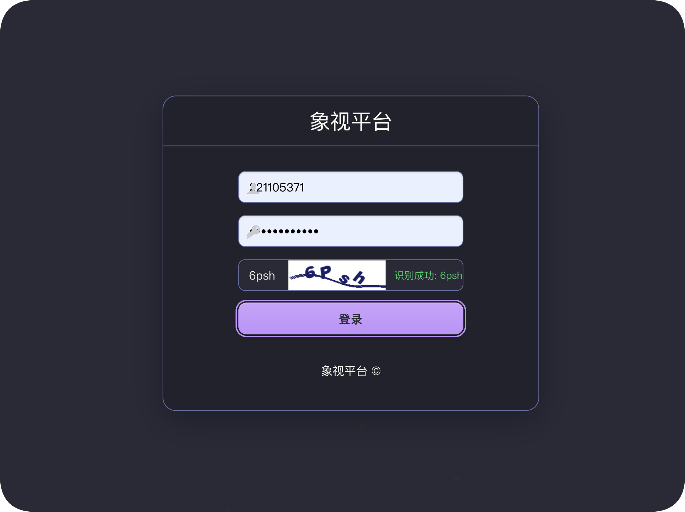
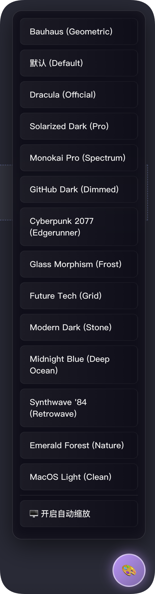
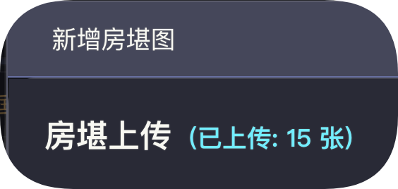
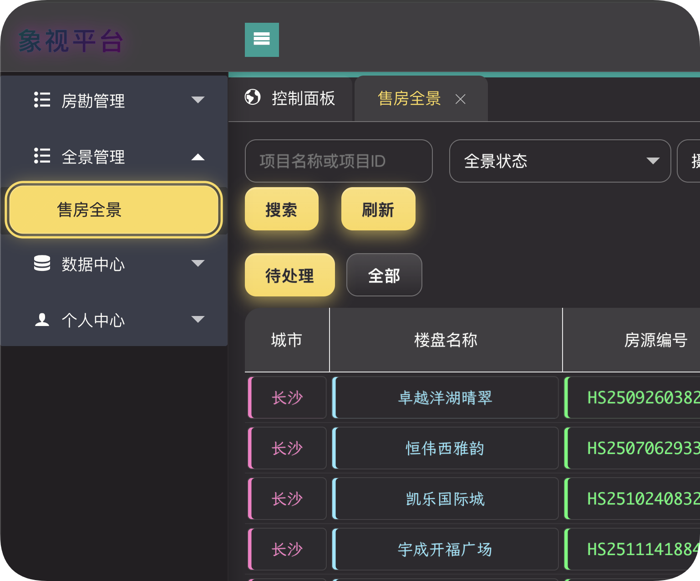
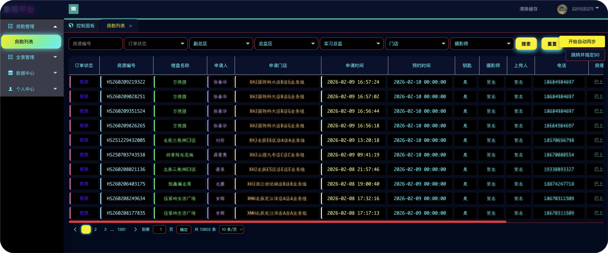

# 🚀 Xiangshi Platform Assistant · XHJ VR Assistant

> A production-grade enhancement userscript for Xiangshi Admin: **deep visual polish + workflow automation + upload pipeline acceleration + cross-iframe consistency**.

---

## 📚 Contents

- [Project Positioning](#-project-positioning)
- [Capability Overview](#-capability-overview)
- [Detailed Feature Guide](#-detailed-feature-guide)
- [Theme System](#-theme-system)
- [Install & Update](#-install--update)
- [Versioning Policy](#-versioning-policy)
- [Compatibility & Adaptation](#-compatibility--adaptation)
- [Previews](#-previews)
- [FAQ](#-faq)
- [Disclaimer](#-disclaimer)

## 🎯 Project Positioning

This project is not just a skin pack. It is a complete enhancement layer for high-frequency admin workflows:

- **UI layer**: unified HUD style and stronger visual hierarchy.
- **Interaction layer**: batch sync, status coloring, action button realignment.
- **Workflow layer**: fewer repeated clicks, shorter operation path.
- **Stability layer**: non-invasive enhancement without changing backend API contracts.

## 🧠 Capability Overview

### 1) Visual System
- Unified HUD-like style for header/sidebar/table/modal/button/input.
- Better contrast and typography layering for dense operational screens.
- Consistent light, border, and shadow language across contexts.

### 2) Automation Capabilities
- One-click auto-sync workflow with visible status feedback.
- Reduced repetitive operations in routine management pages.
- Error-prone steps are converted into guided, visible actions.

### 3) Upload Enhancements
- Survey upload counting and status recognition improvements.
- Panorama upload success/failure/uploading state tracking.
- Timeout policy for stuck uploads with quick retry entrance.

### 4) Local Intelligence
- ONNX Runtime local CAPTCHA recognition.
- No third-party API key dependency.
- Better privacy and operational stability.

### 5) Cross-Context Consistency
- Main page, popup layer, and iframe pages stay visually aligned.
- Dialog action controls are repositioned and normalized for usability.

## 🔍 Detailed Feature Guide

### 🎨 Visual System

#### Global HUD Transformation
- Converts mixed page styles into a coherent futuristic HUD language.
- Reduces “native + patched” style mismatch in enterprise pages.
- Improves readability in low-light, long-session usage scenarios.

#### Text & Status Semantics
- Strong color semantics for primary/secondary/risk states.
- Better hover/active/focus consistency for precise operations.

### ⚙️ Automation Capabilities

#### One-Click Auto Sync
- Batch-triggers sync behaviors from operational pages.
- Adds clearer progress and result feedback.
- Keeps backend logic untouched while improving throughput.

#### Interaction Efficiency
- Moves high-frequency controls to more natural positions.
- Cuts down pointer travel distance and accidental misses.

### 📤 Upload Enhancements

#### Survey Upload Improvements
- Better counting stability and duplicate counter cleanup.
- Improved action button alignment and size consistency in dialog headers.

#### Panorama Upload Improvements
- Recognizes `uploaded`, `failed`, and `uploading` states continuously.
- Shows a visible `Retry Failed (X)` control when failure exists.
- Stuck `uploading` state is force-marked as failure after timeout (current threshold: 150s).

### 🧩 Table and Layout Intelligence
- Business-aware column width tuning for survey and panorama pages.
- Better density handling for long-value columns.
- Faster scan-and-click rhythm in crowded data tables.

### 🔐 Local Verification (AutoVerify)
- Local ONNX inference pipeline.
- Reduced dependency on external verification services.
- Suitable for stable automation prerequisites in enterprise environments.

## 🌈 Theme System

Built-in themes include:

- Star Wars HUD (Immersive)
- Dracula (Official)
- Monokai Pro
- Solarized Dark (Pro)
- MacOS Light
- Cyberpunk 2077
- Synthwave '84'
- Emerald Forest
- Glass Morphism
- Future Tech
- Bauhaus
- Modern Dark
- Midnight Blue
- GitHub Dark
- Default (official baseline)

## 🛠 Install & Update

### Installation
1. Install **Tampermonkey** (Chrome / Edge / Firefox).
2. Install the script that matches your GreasyFork page:
   - `xhj_assistant_534783.user.js`
   - `xhj_assistant_563982.user.js`
   - `xhj_assistant_563997.user.js`
3. Open Xiangshi Admin: `https://vr.xhj.com/houseadmin/`
4. Refresh page and enable script features.

### Update Strategy
- Auto update via userscript manager is recommended.
- Version follows `x.x.x` incremental releases.
- Three GreasyFork scripts keep “same code, different names” distribution.

## 🧭 Versioning Policy

- Uses **SemVer-style patch progression**: `5.0.8 → 5.0.9 ...`
- Each change synchronizes:
  - main script `xhj_assistant.user.js`
  - three distributed scripts `xhj_assistant_*.user.js`
  - version badges in both READMEs

## ✅ Compatibility & Adaptation

- **Domains**: `vr.xhj.com`, `*.xhj.com`
- **Contexts**: main pages, layer popups, iframe child pages
- **UI stack**: Layui + Element UI mixed scenarios
- **Browsers**: latest stable Chrome / Edge recommended

## 🖼 Previews

## ❓ FAQ

### Q1: Why theme changes are not visible?
- Ensure Tampermonkey script is enabled.
- Ensure current URL matches `@match` rules.
- Hard refresh with `Ctrl/Cmd + Shift + R`.

### Q2: Why retry button is not shown?
- It appears only when at least one item is in failed state.
- Long-running uploading items will auto-switch to failed after 150s timeout.

### Q3: Does it alter backend data structures?
- No. It focuses on frontend UX and workflow efficiency only.

## ⚠️ Disclaimer

- This project is designed to improve admin operation quality and efficiency.
- If target DOM structure changes significantly, adaptation updates may be required.
- Issues and PRs are welcome for continuous hardening and compatibility upgrades.
