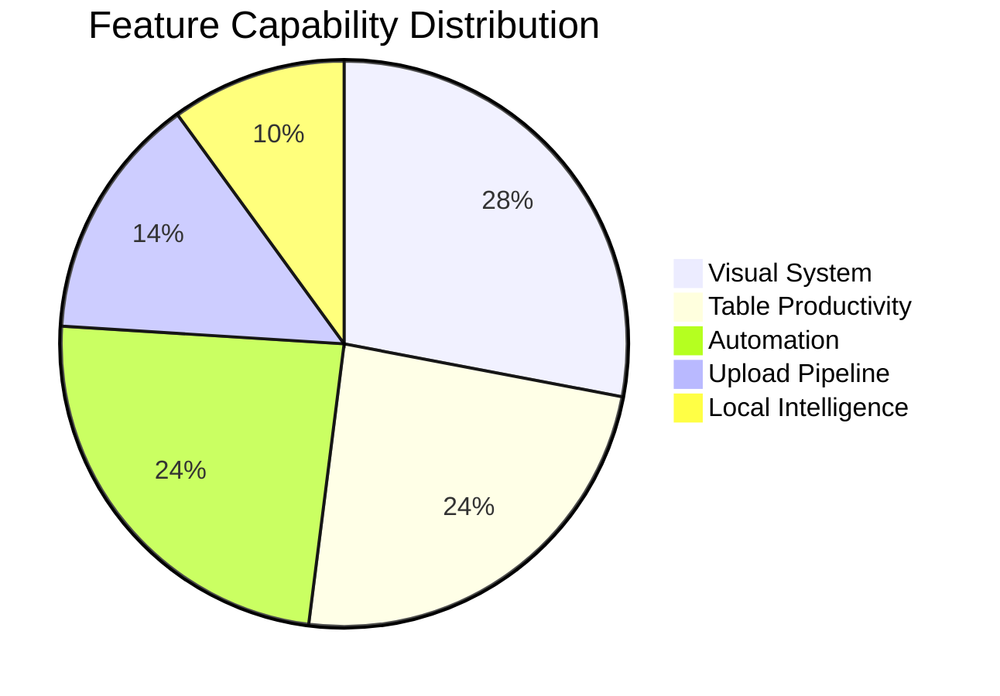
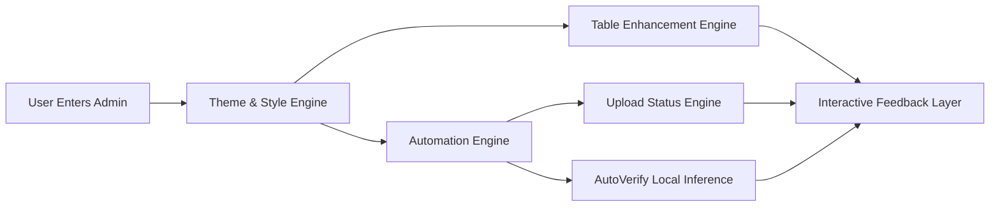
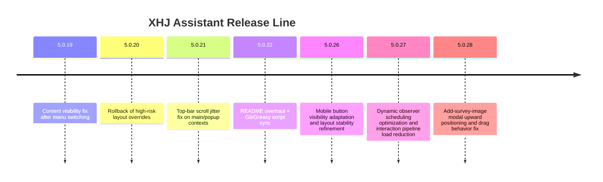

# 🌌 Xiangshi Platform Assistant · XHJ VR Assistant

> A production-grade enhancement suite for Xiangshi Admin: **premium theming + table productivity + workflow automation + upload pipeline optimization + local intelligence**.

---

## 📌 Contents

- [Highlights](#highlights)
- [Latest Update v5.0.28](#latest-update-v5028)
- [Feature Panorama](#feature-panorama)
- [Theme Matrix](#theme-matrix)
- [Charts & Diagrams](#charts--diagrams)
- [Installation & Deployment](#installation--deployment)
- [Technical Overview](#technical-overview)
- [Versioning Policy](#versioning-policy)
- [Screenshots](#screenshots)
- [FAQ](#faq)
- [Disclaimer](#disclaimer)

## Highlights

- Rebuilt visual hierarchy for dense admin pages with consistent HUD aesthetics.
- Table-first productivity: column persistence, row double-click copy, status highlights.
- Automation toolkit: auto-sync, smart scaling, upload retry, dynamic observers.
- Local intelligence: ONNX-based CAPTCHA workflow without external API keys.
- Cross-context consistency: main pages, modal layers, and iframes stay aligned.

## Latest Update v5.0.28

- Fixed the "Add Survey Images" modal opening too low on screen.
- Switched the modal to fixed positioning so upward dragging remains stable after page scroll.
- Published as `v5.0.28` with synchronized Git and all Greasy metadata headers.

## Feature Panorama

### 🎨 Visual System
- 15 built-in themes (dark / neon / glass / cyber / bauhaus styles).
- Unified design language for table, button, input, modal, and pager.
- Semantic color boost for faster visual scanning and action priority.

### 📊 Table Productivity
- `layui.table` render hook enhancements.
- Persistent header config (column order + visible/hidden states).
- Double-click row to copy house source number.
- Light status highlighting by business state.
- Scenario-specific layout tuning for survey list and panorama management.

### ⚡ Automation
- Batch auto-sync to reduce repetitive clicks.
- Toggleable smart scaling with per-page guard strategy.
- Failed upload detection and quick retry entrance.
- MutationObserver + fallback polling to keep enhancements alive on dynamic pages.

### 🧠 Local Intelligence
- AutoVerify powered by ONNX Runtime (local inference).
- Auto-locate CAPTCHA image and input field, then fill recognition result.
- Better privacy and lower external dependency risk.

## Theme Matrix

| Category | Themes |
|---|---|
| Dark Stack | Dracula, Monokai Pro, Solarized Dark, GitHub Dark, Modern Dark, Midnight Blue |
| Neon Stack | Cyberpunk 2077, Synthwave '84', Star Wars HUD, Future Tech |
| Material Stack | Glass Morphism, Bauhaus |
| Nature Stack | Emerald Forest |
| Light Stack | MacOS Light |
| Baseline | Default |

## Charts & Diagrams

### 1) Capability Distribution

### 2) Runtime Flow

### 3) Release Timeline

## Installation & Deployment

### Install via Tampermonkey
1. Install Tampermonkey on Chrome / Edge / Firefox.
2. Install and enable one of the distribution scripts.
3. Open `https://vr.xhj.com/houseadmin/` and refresh.

### GreasyFork (3 scripts)

- [Script 534783](https://greasyfork.org/en/scripts/534783)
- [Script 563982](https://greasyfork.org/en/scripts/563982)
- [Script 563997](https://greasyfork.org/en/scripts/563997)

### GitHub

- [Repository](https://github.com/jhihhe/XHJ-VR-assistant)
- [Issues](https://github.com/jhihhe/XHJ-VR-assistant/issues)
- [Commits](https://github.com/jhihhe/XHJ-VR-assistant/commits/main)

## Technical Overview

| Dimension | Detail |
|---|---|
| Script Type | Tampermonkey Userscript |
| Core Language | JavaScript (ES6+) |
| UI Stack | Layui + Element UI mixed ecosystem |
| Mechanisms | CSS variables, DOM hooks, event injection, MutationObserver |
| Intelligence | ONNX Runtime Web (local inference) |
| Coverage | Main pages + Layer modals + iframe pages |

## Versioning Policy

- SemVer-style incremental flow: `5.0.8 → 5.0.28`.
- Every release synchronizes:
  - main file `xhj_assistant.user.js`
  - three Greasy distribution files
  - version badges and descriptions in both READMEs

## Screenshots

## FAQ

### Q1: Theme changes are not visible
- Ensure script is enabled in Tampermonkey.
- Ensure URL matches `@match` rules.
- Hard refresh with `Ctrl/Cmd + Shift + R`.

### Q2: Why header configuration is not saved
- Complete column adjustment first, then click save.
- Config is persisted per-page-path in local storage.

### Q3: Does it modify backend data
- No. It focuses on frontend UX and workflow efficiency only.

## Disclaimer

- This project is for compliant productivity and UX improvements.
- If upstream DOM/business structure changes significantly, adaptation updates may be required.
- Issues and PRs are welcome.
