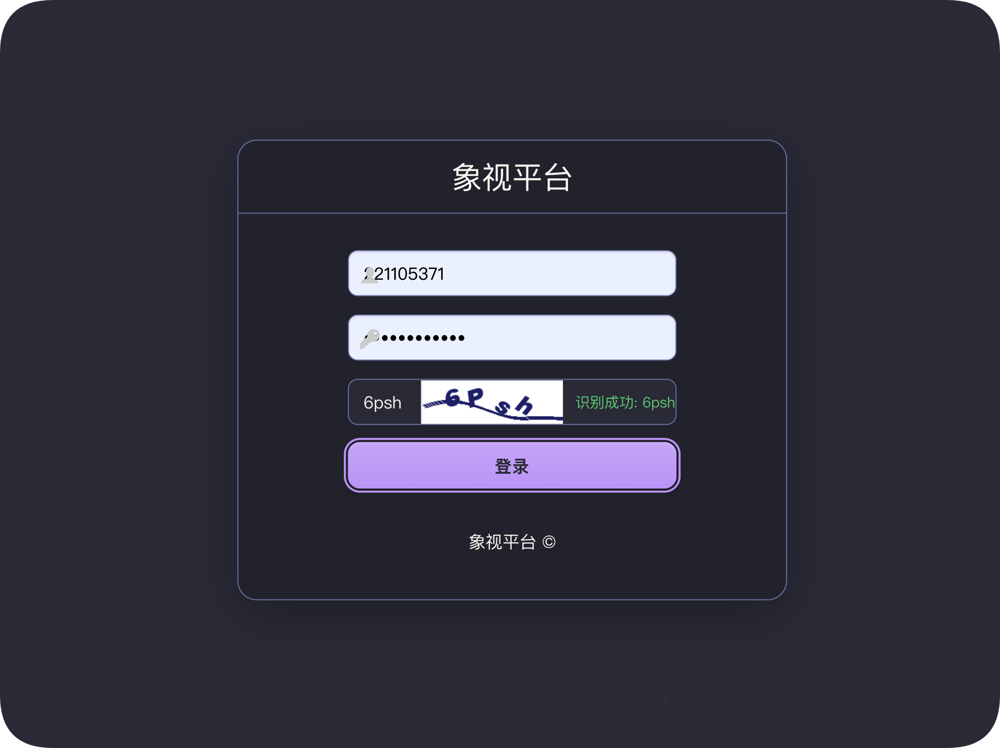
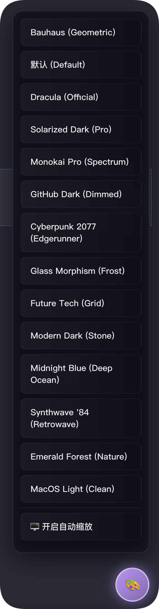
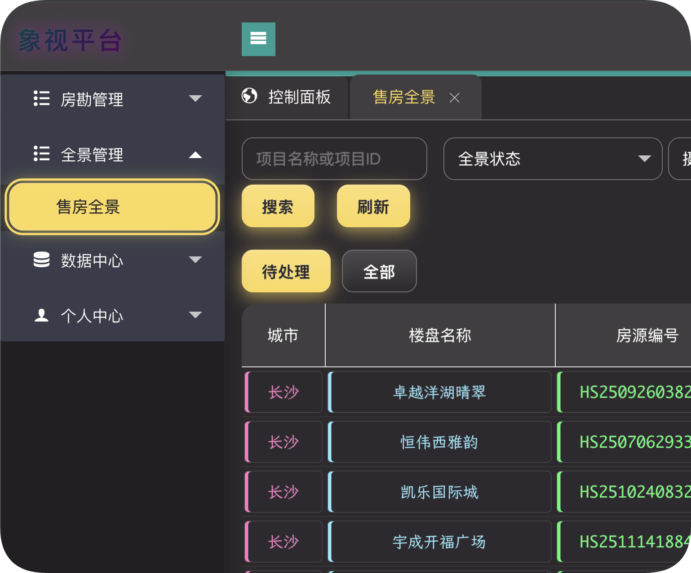
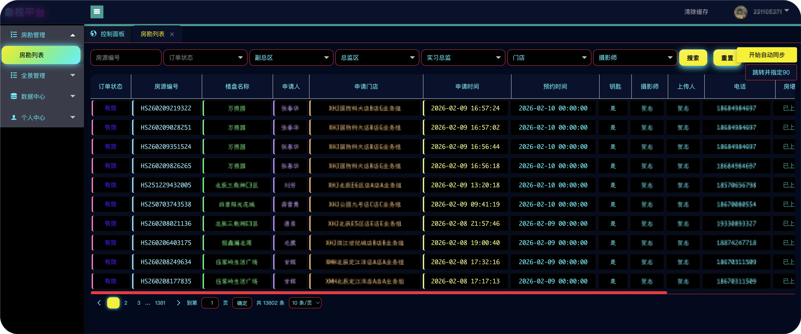

# 🎨 象视平台助手 (v2.5.4)

[中文](README.md) | [English](README-EN.md) | [GitHub 项目主页](https://github.com/jhihhe/XHJ-VR-assistant)

**为象视平台后台管理系统提供极致的 macOS 风格深色模式、智能排版优化与高效自动化工具。**

这是一个专为 [象视平台后台](https://vr.xhj.com/houseadmin/) 开发的 Tampermonkey (油猴) 脚本。它不仅仅是简单的换肤，更是一次对后台管理系统的全方位升级。我们将**极致 UI 美化**与**自动同步功能**完美融合，打造了一个集视觉享受与高效办公于一体的综合助手。

## 📸 效果预览

  

  
  

  
  

## ✨ 核心特性

### 1. 🖥️ 极致 macOS 风格 UI
*   **玻璃拟态 (Glassmorphism)**：侧边栏、弹窗、卡片采用高级的背景模糊与半透明效果。
*   **光影美学**：精心调校的阴影（Shadow）与发光（Glow）效果，让界面元素层次分明，拒绝扁平化。
*   **流畅动效**：按钮点击涟漪、菜单回弹、悬浮缩放等微交互，带来丝般顺滑的操作体验。
*   **圆角设计**：全站元素圆角化处理，视觉更加柔和舒适。
*   **Auto Scale 自动缩放**：(v1.33+) 智能全屏适配功能，默认以屏幕宽度的 120% 进行缩放，解决小屏显示不全问题，支持一键开关。
*   **UI/UX 深度优化 (v1.44)**：全主题配色升级为 Pro 级标准 (Monokai Pro/Dracula Official/Solarized Pro)，细节打磨更极致。

### 2.  智能自动同步 (v1.16 新增)
*   **一键同步**：集成“自动同步”功能，一键即可批量处理房勘/全景数据的同步任务。
*   **智能追踪**：实时显示同步进度与状态，自动跳过已同步项，高效省心。
*   **无缝融合**：同步按钮与控制面板完美适配当前深色主题，告别突兀的样式冲突。

### 3. 📊 智能列表排版引擎
*   **代码框式字段**：表格内容采用“代码框”风格设计，每个字段拥有独立的背景色与边框，清晰易读。
*   **智能色彩编码**：利用 `nth-child` 选择器为不同列自动分配差异化颜色，防止视觉疲劳。
*   **单行全显优化**：强制拉伸列宽，确保长文本（如楼盘名称、时间）在一行内完整显示，告别换行困扰。
*   **多业务自适应**：
    *   **房勘列表**：保留经典紧凑布局。
    *   **售房全景**：自动识别并启用专属宽屏布局，完美适配“户型图”、“全景状态”等特殊列。

### 4. 🎨 多款精选主题
内置多款经典配色方案，一键切换：
*   🧛🏻‍♂️ **Dracula (Official)** (官方正版配色 - 更加精准的吸血鬼风)
*   🍭 **Monokai Pro** (Spectrum 风格 - 现代高级灰与高饱和色彩的碰撞)
*   ☀️ **Solarized Dark (Pro)** (专业护眼 - 增强了对比度与青色活力)
*   🍎 **MacOS Light** (v1.43 新增 - 苹果极简白风格)
*   🔮 **Cyberpunk 2077** (Edgerunner 风格 - 强烈的蓝红对比与霓虹干扰)
*   🎸 **Synthwave '84** (Retrowave 风格 - 梦幻紫与镭射粉)
*   🌲 **Emerald Forest** (v1.42 新增 - 极光森林绿)
*   🧊 **Glass Morphism** (Frost 风格 - 极致磨砂与半透明)
*   🤖 **Future Tech** (Grid 风格 - 动态网格与科技蓝)
*   📐 **Bauhaus** (v2.5.4 新增 - 经典几何与红黄蓝撞色，致敬包豪斯设计)
*   🗿 **Modern Dark** (Stone 风格 - 温暖的石墨深灰)
*   � **Midnight Blue** (Deep Ocean 风格 - 沉浸式深海蓝)
*   🐱 **GitHub Dark** (GitHub 官方深色)
*   🔙 **默认** (一键恢复官方原版样式)

### 5. 🛠️ 深度 Layui 适配与修复
*   **完美对齐**：修复了原版 Layui 表格表头与内容像素级不对齐的问题。
*   **去白底化**：彻底清除了 Tab 栏、分页器、按钮组等处残留的突兀白色背景。
*   **全站同步**：支持主页面与 iframe 子页面样式实时无缝同步，刷新即享。

### 6. 🤖 智能验证码识别 (v2.0 新增)
*   **AutoVerify 引擎**：集成轻量级 ONNX Runtime，本地高效识别登录页图形验证码。
*   **隐私安全**：无需上传图片至第三方服务器，所有处理均在本地完成，安全无忧。
*   **零配置**：开箱即用，无需申请 API Key 或进行复杂配置。

### 7. 🔐 登录页深度美化 (v2.5.3)
*   **全主题适配**：登录页 (`/houseadmin/login/index.html`) 背景、卡片、控件完全跟随当前主题切换，告别突兀的默认白底。
*   **磨砂视效**：登录框采用高级 Glassmorphism 磨砂玻璃效果，搭配动态光影与呼吸感交互，提升系统第一印象。
*   **细节打磨**：保留原有粒子动画并优化其透明度，确保在深色主题下依然清晰可读。

### 8. 🔢 智能计数与交互 (v2.5)
*   **精准穿透统计**：采用“子级推送”机制，完美解决 Layui iframe 嵌套导致的房勘图片计数丢失问题，实现 100% 准确的实时统计已上传房堪图片数量。
*   **零干扰布局**：智能移除弹窗顶部冗余的父级计数器，仅保留内容区域的实时统计，界面更加清爽聚焦。

## 🚀 使用方法

1.  安装浏览器扩展 **Tampermonkey** (Chrome/Edge/Firefox)。
2.  **安装脚本**：将 `xhj_assistant.user.js` 安装到 Tampermonkey 中。
3.  打开象视平台后台管理页面。
4.  **换肤**：点击页面右下角的 **🎨 悬浮球**，选择你喜欢的主题。
5.  **同步**：在支持的列表页（如房勘列表），点击顶部的 **🔄 自动同步** 按钮即可开始工作。

## 📝 更新日志

### v2.5.4 (2026-02-09)
- **新主题**: 新增 **Bauhaus (包豪斯)** 风格主题，采用经典的红黄蓝三原色与几何图形背景，配合锐利的直角设计，致敬现代主义设计经典。

### v2.5.3 (2026-02-09)
- **登录页美化**: 新增登录页 (`/houseadmin/login/index.html`) 主题适配功能，背景图、登录框及控件样式将跟随当前主题自动切换，支持磨砂玻璃特效。

### v2.5.2 (2026-02-09)
- **计数器优化**: 移除了“新增房堪图”弹窗顶部的父级重复计数，仅保留内容区域更准确的子级计数，界面更加清爽。

### v2.5.1 (2026-02-09)
- **逻辑重构**: 房堪上传计数采用“子级推送”机制，修复了 iframe 内部计数消失及父级统计为 0 的问题。

### v2.5 (2026-02-09)
- **功能修复**: 修复了房堪上传弹窗中图片计数器重复显示的问题，并增强了 iframe 穿透统计能力。

### v2.0 (2026-02-09)
- **重大更新**：全面集成 **AutoVerify** 智能验证码识别引擎，支持登录页图形验证码自动识别与填写（基于 ONNX Runtime 本地运行，无需外部 API）。
- **Safari/iOS 深度适配**：新增针对 Safari 浏览器（macOS）及 iPhone/iPad 的专属优化，修复玻璃拟态渲染异常，优化触摸滚动与移动端布局。
- **体验优化**：引入 MutationObserver 机制，彻底解决新开窗口/弹窗主题应用延迟问题，实现“秒开秒换”。
- **底层重构**：引入动态资源加载机制，大幅提升脚本加载速度与稳定性。

### v1.48 (2025-02-08)
- **项目主页集成**：脚本元数据中新增 `homepageURL` 和 `supportURL`，方便用户访问 GitHub 项目主页获取最新版本及反馈问题。
- **文档更新**：README 增加项目主页链接，版本号同步更新。

### v1.47 (2025-02-08)
- **Toast 消息美化**：告别 Layui 原始的方块弹窗，全新设计了 MacOS 风格的“胶囊式”消息提示。
- **全局磨砂玻璃**：所有弹窗（Dialog/Layer）均升级为磨砂玻璃背景 (Blur + Translucent)，与 MacOS Light 主题完美融合。
- **细节微调**：优化了图标位置和文字排版，视觉更加精致。

### v1.46 (2025-02-08)
- **纯净 MacOS 模式**：针对“MacOS Light”主题进行专项深度优化，像素级还原系统质感。
- **侧边栏去黑**：强制移除 Layui 侧边栏的黑色背景，应用正统的半透明磨砂玻璃效果 (Frosted Glass)。
- **系统级配色**：将 Layui 默认的高饱和按钮（蓝/红/橙）中和为标准的 Apple 系统配色（San Francisco Blue, Sunset Orange 等）。
- **视觉柔化**：降低整体对比度和阴影硬度，打造更干净、更扁平但富有层次的视觉体验。

### v1.45 (2025-02-08)
- **视觉升级**：全面增强所有主题的立体感和生动度
- **3D 效果**：为卡片和按钮添加精致的层叠阴影和微光渐变
- **细节优化**：
  - 按钮增加内阴影和点击涟漪效果
  - 卡片悬停时的动态浮起效果更自然
  - 侧边栏和顶部导航栏的材质感增强
- **主题适配**：所有 12 款主题均已适配新的光影系统
- **深度适配**：新增对 Element UI 组件（弹窗、表单、按钮）和原版平台自定义组件（.topbox, .isAction）的完美支持，确保后台管理系统风格高度统一。

### v1.44 (2025-02-08)
*   **UI/UX 深度优化**：全主题配色升级为 Pro 级标准 (Monokai Pro/Dracula Official/Solarized Pro)，细节打磨更极致。

### v1.40
*   **全景上传页 DPI 修复**：针对全景图管理的上传页面（弹窗或独立页面），自动识别并**禁用自动缩放 (Auto Scale)** 功能。这解决了因自动缩放导致的上传窗口 DPI 显示异常（如字体模糊、控件错位）的问题，确保上传操作的精准性。

### v1.39
*   **搜索栏对齐深度修复**：
    *   **强制顶部对齐**：针对 Layui 布局中可能出现的垂直对齐不一致问题（如输入框、下拉框、时间选择器不在同一水平线上），现在强制将搜索栏及其同行的所有表单元素（包括右侧的下拉框和时间选择器）统一设为顶部对齐 (`vertical-align: top`)。
    *   **容器优化**：重构了搜索栏的包装容器，完整复制原始 Layui 类名，并清除了内部元素的干扰边距，确保与原生组件完美融合。

### v1.38
*   **搜索栏排版修复**：改进了搜索栏的容器布局方式（从 flex 改为 inline-block），修复了在部分屏幕尺寸下，右侧筛选框与搜索栏对齐不一致的问题，增强了布局的稳定性。
*   **Auto Scale 调整**：应用户要求，回滚了最小缩放比例限制，并将默认自动缩放比例基准调整为 **120%**（原 125%），以提供更合适的视野。

### v1.37
*   **搜索栏排版优化**：进一步优化了“售房全景”页面的搜索栏布局。现在输入框和搜索按钮组合在一起，不会强制换行，右侧的筛选下拉框可以自动流式排列，减少了页面空白，视觉效果更紧凑。
*   **Auto Scale 优化**：调整了自动缩放逻辑，增加了**最小缩放比例限制 (1.0)**。这意味着当窗口缩小（如占屏幕 3/4）时，网页内容不会过度缩小，始终保持清晰可读。

### v1.36
*   **搜索栏布局优化**：在“售房全景”管理页面，将“搜索”和“刷新”按钮移动至“项目名称或项目ID”输入框下方，并调整按钮大小与“待处理/全部”按钮一致，使操作区域更加紧凑合理。

### v1.35
*   **Auto Scale 默认开启**：响应用户需求，Auto Scale 自动缩放功能现在**默认开启**。新用户安装或清除缓存后，将自动体验 125% 的全屏自适应布局，无需手动设置。

### v1.34
*   **Auto Scale 逻辑优化**：自动缩放功能的基准从固定的 1920px 调整为 **当前屏幕分辨率宽度的 125%**。这意味着在全屏状态下，页面内容将默认放大至 125%，更加适合高分屏用户或需要更大字体的场景，同时依然保持窗口大小变化的自适应能力。

### v1.33
*   **Auto Scale 自动缩放**：新增全屏自适应功能。以 1920px 为基准，当浏览器窗口大小改变时，自动缩放页面内容以保持最佳布局比例，彻底解决小屏幕下内容显示不全的问题。您可以在 UI 悬浮菜单中随时开启或关闭此功能。

### v1.32
*   **状态指示增强**：进一步扩展了状态文本的识别范围，新增对“上传中...”、“上传成功”及“上传”（按钮）的颜色区分，全面覆盖上传全流程的状态显示。
*   **兼容性优化**：扩大了状态文本的检测范围（支持 `div`、`span` 及按钮文本），确保在不同页面结构下均能正确着色。

### v1.31
*   **Polish Style UI 重磅升级**：深度复刻 V2EX Polish 风格，引入大圆角设计（18px）、SF Pro Rounded 字体栈以及细腻的阴影效果，让界面更加圆润现代，同时保留了各主题的原有配色。
*   **主题自适应优化**：UI 悬浮球与菜单现在会自动跟随当前选择的主题颜色变化（支持自定义 Glow 光晕与渐变色），实现真正的全主题沉浸式体验。
*   **VR上传状态可视化**：在房勘/全景列表页，针对“正在上传”（橙黄色+呼吸闪烁）、“上传完成”（荧光绿+高亮）及“上传失败”（红色警示）等状态文本增加了显著的颜色区分与动态光影效果，一眼掌握任务进度。

### v1.30
*   **全新主题 Future Tech**：新增“未来科技 (Neon)”主题，采用深邃蓝黑背景搭配高饱和霓虹光效，并内置动态网格背景，营造极致赛博朋克体验。
*   **全局波纹特效**：新增点击波纹 (Ripple Effect) 交互，每一次点击都伴随流光溢彩的扩散动画，操作反馈感拉满。
*   **UI 交互全面升级**：
    *   **悬浮球进化**：升级为渐变光球，支持鼠标悬停旋转与呼吸光晕。
    *   **菜单玻璃拟态**：主题菜单采用更细腻的 Glassmorphism 毛玻璃效果，展开/收起增加丝滑缩放动画。
    *   **细节打磨**：菜单项悬停增加滑动高亮与边缘发光效果。

### v1.18
*   **弹窗尺寸智能扩容**：针对“新增房堪图”等弹窗进行强制扩容（高度+300px，宽度+100px），彻底解决底部按钮显示不全的问题，无需手动调整窗口大小。
*   **布局自动校正**：在扩容的同时自动重新计算弹窗位置，确保其始终垂直/水平居中，防止顶部溢出。
*   **列宽精细调整**：售房全景中“操作”、“全景状态”、“卧室”列宽增至 1.4 倍，提升信息可读性。
*   **Loading 界面适配**：修复加载等待框（Loading）的白色背景问题，完美适配深色主题。

### v1.17
*   **模态框深度修复**：针对“新增房堪图”等复杂表单弹窗进行深度适配，强制覆盖白色背景，修复标签、输入框及上传区域的配色问题。
*   **Element UI 全面适配**：新增对 Vue/Element UI 组件的专属深色样式支持，完美适配 `el-dialog`、`el-input`、`el-select` 等组件。
*   **列宽智能缩减**：响应用户需求，大幅缩减售房全景中的“操作”列及其他冗余列宽，提升空间利用率。
*   **精细化排版控制**：引入动态列索引识别技术，对“设计师”、“全景状态”、“时间”等 7+ 个核心列进行像素级宽度定制；时间列强制单行显示，空间利用率提升 40%。
*   **域名适配增强**：扩展脚本作用域至所有 `*.xhj.com` 子域名，确保跨域弹窗（iframe/Layer）也能正确加载主题。

### v1.16 (里程碑版本)
*   **功能合并**：将原“象视自动同步”脚本完美融合，实现“换肤+同步”二合一。
*   **品牌升级**：脚本正式更名为“象视平台助手 (Xiangshi Platform Assistant)”。
*   **弹窗修复**：彻底修复“新增房堪图”等弹窗的白色背景问题，实现全域深色模式。
*   **UI 统一**：自动同步按钮与面板深度适配 Dracula 等主题，视觉体验更统一。

### v1.15
*   **弹窗适配**：针对业务弹窗进行深度适配，修复白色背景刺眼问题。
*   **组件优化**：美化文件上传组件（Upload Drag），使其融入深色主题。

### v1.14
*   **多业务列表自适应**：智能识别“房勘列表”与“售房全景”，自动应用不同的列宽策略。
*   **样式回滚**：应用户反馈，将“房勘列表”恢复至 v1.12 的经典样式。
*   **Bug 修复**：修复了“售房全景”中状态列和图片列出现“双重文字框”的显示问题。

### v1.10 - v1.13
*   **单行显示优化**：大幅调整表格 CSS，强制长字段不换行，提升阅读效率。
*   **UI 重构**：引入 macOS 风格光影，增强按钮和卡片的立体感。

### v1.0 - v1.09
*   首发版本，实现基础换肤、iframe 同步及 Dracula 主题。

---

> **注意**：本脚本仅更改本地界面样式及模拟点击操作，不会修改任何后台核心数据结构，请放心使用。
