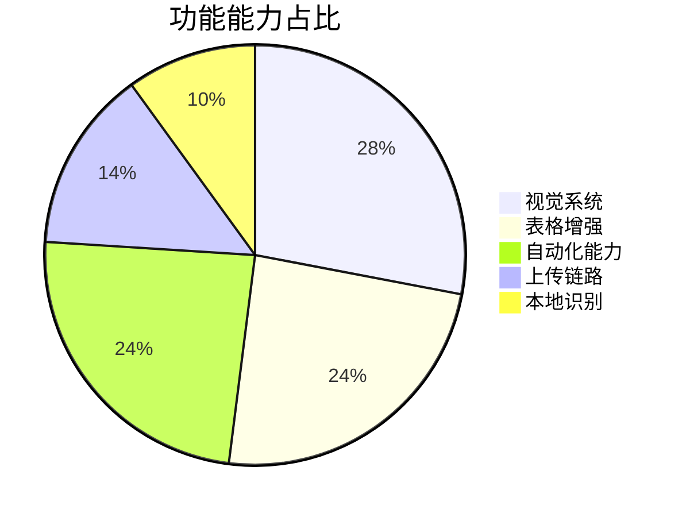
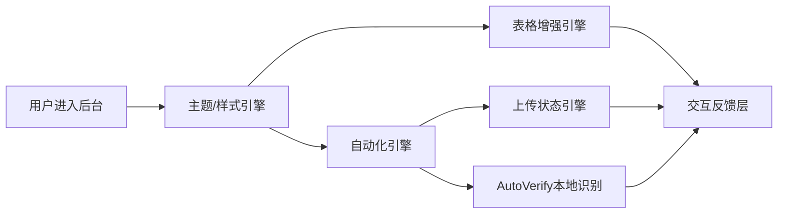
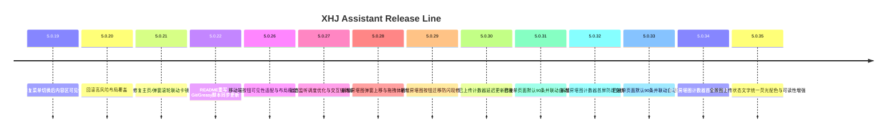

# 🌌 象视平台助手 · XHJ VR Assistant

> 为象视后台打造的一体化增强引擎：**高级主题美化 + 表格增强 + 自动化提效 + 上传链路优化 + 本地智能识别**。  
> 目标是让“高频后台操作”更快、更稳、更顺手。

---

## 📌 目录

- [项目亮点](#项目亮点)
- [最新更新 v5.0.35](#最新更新-v5035)
- [功能全景](#功能全景)
- [主题矩阵](#主题矩阵)
- [图形图表](#图形图表)
- [安装部署](#安装部署)
- [技术概览](#技术概览)
- [版本策略](#版本策略)
- [预览截图](#预览截图)
- [FAQ](#faq)
- [免责声明](#免责声明)

## 项目亮点

- 高密度后台页面的视觉重构：统一 HUD 风格，重点信息更醒目。
- 表格工作流增强：列配置保存、双击复制、状态高亮、操作区排版优化。
- 自动化能力集成：一键同步、自动缩放、上传重试、动态状态监测。
- 本地智能识别：ONNX 验证码识别链路，无需外部 API Key。
- 跨上下文一致：主页面、弹窗、iframe 风格与交互保持统一。

## 最新更新 v5.0.35

- 统一“新增全景图”上传状态色：上传中为荧光红，上传成功为荧光绿。
- 增强状态文字跨主题可读性，补充描边与多层发光，并同步覆盖按钮内部文字节点。
- 同步发布 `v5.0.35`，统一脚本头部元数据与文档版本信息。

## 功能全景

### 🎨 视觉系统
- 15 套主题快速切换（暗黑 / 霓虹 / 玻璃 / 赛博 / Bauhaus 等）。
- 表格、按钮、输入框、弹窗、分页统一材质与阴影层次。
- 状态语义色增强，扫描列表时一眼定位优先级。

### 📊 表格增强
- `layui.table` Hook 增强渲染流程。
- 表头配置可持久化（列显隐、列顺序保存/恢复）。
- 双击行自动复制房源编号，减少机械操作。
- 按业务状态进行浅色高亮（待接单/已接单/取消/无效）。
- 房堪列表/全景管理列宽与操作栏按场景优化。

### ⚡ 自动化能力
- 批量自动同步，减少重复点击。
- 自动缩放可开关 + 比例可调（页面场景智能禁用）。
- 上传失败项自动识别与重试入口。
- 动态内容监听（MutationObserver + 低频兜底）保持增强持续生效。

### 🧠 本地智能识别
- AutoVerify 基于 ONNX Runtime 的本地识别流程。
- 验证码图与输入框自动匹配，识别结果自动填入。
- 不依赖云打码服务，隐私与可控性更高。

## 主题矩阵

| 分类 | 主题 |
|---|---|
| 深色系 | Dracula、Monokai Pro、Solarized Dark、GitHub Dark、Modern Dark、Midnight Blue |
| 霓虹系 | Cyberpunk 2077、Synthwave '84'、Star Wars HUD、Future Tech |
| 质感系 | Glass Morphism、Bauhaus |
| 自然系 | Emerald Forest |
| 浅色系 | MacOS Light |
| 基线 | Default |

## 图形图表

### 1) 能力分布图

```mermaid
pie title 功能能力占比
    "视觉系统" : 28
    "表格增强" : 24
    "自动化能力" : 24
    "上传链路" : 14
    "本地识别" : 10
```

### 2) 执行流程图

```mermaid
flowchart LR
    A[用户进入后台] --> B[主题/样式引擎]
    B --> C[表格增强引擎]
    B --> D[自动化引擎]
    D --> E[上传状态引擎]
    D --> F[AutoVerify本地识别]
    C --> G[交互反馈层]
    E --> G
    F --> G
```

### 3) 版本推进图

```mermaid
timeline
    title XHJ Assistant Release Line
    5.0.19 : 修复菜单切换后内容区可见性
    5.0.20 : 回滚高风险布局覆盖
    5.0.21 : 修复主页/弹窗滚轮联动卡顿
    5.0.22 : README重写 + Git/Greasy脚本同步更新
    5.0.26 : 移动端按钮可见性适配与布局稳定性优化
    5.0.27 : 动态监听调度优化与交互链路减载
    5.0.28 : 新增房堪图弹窗上移与拖拽体验修复
    5.0.29 : 新增房堪图按钮迁移防闪现修复
    5.0.30 : 已上传计数器延迟更新修复
    5.0.31 : 已接单页面默认90条并联动自动同步
    5.0.32 : 新增房堪图计数器首屏防跳变优化
    5.0.33 : 已接单页面默认90条并联动自动同步
    5.0.34 : 新增房堪图计数器首屏防跳变优化
    5.0.35 : 全景图上传状态文字统一荧光配色与可读性增强
```

## 安装部署

### Tampermonkey 安装
1. 安装浏览器扩展 Tampermonkey（Chrome / Edge / Firefox）。
2. 选择对应脚本安装并启用。
3. 打开 `https://vr.xhj.com/houseadmin/` 并刷新页面。

### GreasyFork 三脚本

- [脚本 534783](https://greasyfork.org/zh-CN/scripts/534783)
- [脚本 563982](https://greasyfork.org/zh-CN/scripts/563982)
- [脚本 563997](https://greasyfork.org/zh-CN/scripts/563997)

### GitHub

- [项目主页](https://github.com/jhihhe/XHJ-VR-assistant)
- [问题反馈](https://github.com/jhihhe/XHJ-VR-assistant/issues)
- [提交记录](https://github.com/jhihhe/XHJ-VR-assistant/commits/main)

## 技术概览

| 维度 | 说明 |
|---|---|
| 脚本类型 | Tampermonkey Userscript |
| 核心语言 | JavaScript (ES6+) |
| UI 场景 | Layui + Element UI 混合 |
| 核心机制 | CSS 变量主题、DOM Hook、MutationObserver、事件注入 |
| 智能识别 | ONNX Runtime Web（本地推理） |
| 适配范围 | 主页面 + Layer 弹窗 + iframe |

## 版本策略

- 采用语义化小版本递进：`5.0.8 → 5.0.35`。
- 每次发布同步更新：
  - 主脚本 `xhj_assistant.user.js`
  - Greasy 三脚本 `xhj_assistant_534783.user.js / xhj_assistant_563982.user.js / xhj_assistant_563997.user.js`
  - `README.md` 与 `README-EN.md` 版本徽章与说明

## 预览截图

## FAQ

### Q1：主题没有生效？
- 检查脚本是否启用。
- 检查当前 URL 是否命中 `@match`。
- 使用 `Ctrl/Cmd + Shift + R` 强刷。

### Q2：表格配置为什么没有保存？
- 先在表头工具中完成调整，再点击“保存表头状态”。
- 配置按路径维度保存在本地存储，不同页面独立。

### Q3：会影响后台数据吗？
- 不会。脚本聚焦前端展示、交互和流程提效，不改后端协议。

## 免责声明

- 本项目仅用于提升后台操作效率与体验，请在合规场景使用。
- 若目标页面 DOM 或业务结构大改，可能需要同步适配脚本。
- 欢迎 Issue / PR 一起完善稳定性和可维护性。
