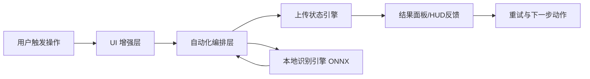

# 🚀 象视平台助手 · XHJ VR Assistant

> 面向象视平台后台的一体化增强脚本：**视觉深度美化 + 流程自动化提效 + 上传链路增强 + 跨 iframe 一致体验**。  
> 适合追求“信息密度高、操作路径短、视觉统一”的高频后台作业场景。

---

## 📚 文档目录

- [项目定位](#-项目定位)
- [核心能力总览](#-核心能力总览)
- [✨ 超炫展示区](#-超炫展示区)
- [详细功能说明](#-详细功能说明)
- [主题系统](#-主题系统)
- [安装与更新](#-安装与更新)
- [版本策略](#-版本策略)
- [兼容与适配](#-兼容与适配)
- [预览截图](#-预览截图)
- [常见问题](#-常见问题)
- [免责声明](#-免责声明)

## 🎯 项目定位

本项目不是简单换肤脚本，而是围绕“**后台重度操作体验**”进行的完整增强层：

- **界面层**：统一 HUD 风格、改善对比度、修复层级视觉割裂。
- **行为层**：批量同步、按钮重排、状态着色、智能计数、失败重试。
- **流程层**：减少重复点击、缩短路径、提升反馈清晰度。
- **稳定层**：优先使用非侵入方式，不改后端接口协议。

## 🧠 核心能力总览

### 1) 视觉系统
- 全站 Dark HUD 化：头部、侧栏、表格、弹窗、输入框、按钮统一风格。
- 栅格背景、边缘辉光、层级阴影，提升信息组织感。
- 关键文本与状态色强化：高亮信息“可一眼识别”。

### 2) 自动化能力
- 一键同步批处理，降低重复手工点击。
- 表格操作区更高可读性，减少误点。
- 上传失败重试入口自动出现，配合超时判定降本提效。

### 3) 上传增强
- 房堪上传计数展示与状态识别优化。
- 全景上传成功/失败/上传中状态动态识别。
- “上传中”超时自动判失败（当前阈值：150s）。

### 4) 智能识别
- 本地 ONNX 推理验证码识别（无需外部 API Key）。
- 更稳定的自动化前置能力，降低人工打码频率。

### 5) 跨上下文一致性
- 主页面、Layer 弹窗、iframe 内页面样式行为保持一致。
- 弹窗按钮重排与对齐优化，减少遮挡与错位。

## ✨ 超炫展示区

### 🆚 功能对比表（上脚本前 vs 上脚本后）

| 维度 | 原生后台体验 | XHJ 助手增强后 |
|---|---|---|
| 视觉一致性 | 多模块风格不统一，层级割裂 | HUD 风格统一，状态与重点更聚焦 |
| 操作路径 | 重复点击多，跨区域跳转频繁 | 常用入口前置，一键同步批处理 |
| 上传反馈 | 状态分散，失败不易追踪 | 成功/失败/上传中着色，超时自动判失败 |
| 批量效率 | 人工逐条确认，易漏操作 | 自动化链路接管，减少机械重复 |
| 跨页面一致性 | 主页与弹窗/iframe 体验不一致 | 主页面、Layer、iframe 同步表现 |
| 风险控制 | 人工盯状态，容错低 | 重试入口与可视反馈更完整 |

### 🧭 架构流程图（从触发到反馈）

```mermaid
flowchart LR
    A[用户触发操作] --> B[UI 增强层]
    B --> C[自动化编排层]
    C --> D[上传状态引擎]
    C --> E[本地识别引擎 ONNX]
    D --> F[结果面板/HUD反馈]
    E --> C
    F --> G[重试与下一步动作]
```

### 🎬 场景化操作指南（3 条黄金路径）

| 场景 | 目标 | 推荐操作路径 | 结果收益 |
|---|---|---|---|
| 批量同步日常作业 | 缩短重复点击链路 | 进入列表页 → 触发一键同步 → 观察 HUD 反馈 | 减少人工逐项操作负担 |
| 上传异常处理 | 快速收敛失败任务 | 打开上传弹窗 → 识别失败/超时项 → 一键重试失败项 | 异常处理路径更短、反馈更清晰 |
| 高密度列表巡检 | 提升扫读速度和命中率 | 使用主题 + 状态着色 → 聚焦状态列与操作列 → 执行关键动作 | 降低误点与漏判概率 |

### 🖼 GIF 占位模板（替换即用）

> 建议将 GIF 文件放在 `docs/gifs/` 目录，并保持 8~15 秒短流程演示。

| 模块 | 建议文件名 | Markdown 模板 |
|---|---|---|
| 一键同步演示 | `autosync-demo.gif` | `` |
| 上传失败重试演示 | `upload-retry-demo.gif` | `` |
| 主题切换演示 | `theme-switch-demo.gif` | `` |
| 跨 iframe 一致性演示 | `iframe-consistency-demo.gif` | `` |

## 🔍 详细功能说明

### 🎨 视觉系统

#### 全局 HUD 改造
- 统一深色主基调与对比层级。
- 按钮、卡片、表格、弹窗采用一致材质语言。
- 减少“默认样式 + 自定义样式”混搭带来的割裂感。

#### 文本与交互反馈
- 关键信息（状态、计数、危险提示）颜色分层。
- 悬浮、聚焦、激活状态统一化，操作反馈更清楚。

### ⚙️ 自动化能力

#### 一键自动同步
- 对业务同步流程做批处理入口整合。
- 使用可视化反馈提示当前状态，避免误判进度。

#### 流程提效
- 常用操作路径前置，减少跨区域鼠标移动。
- 针对上传弹窗中的关键按钮进行布局优化。

### 📤 上传增强

#### 房堪上传增强
- 计数与状态反馈优化，避免重复或错误计数影响判断。
- 弹窗操作按钮在视觉上统一尺寸与对齐，提高点击命中效率。

#### 全景上传增强
- 识别“上传成功 / 上传失败 / 上传中”状态并着色。
- 失败时自动展示“重试失败(X)”按钮。
- 超时策略：若某项持续“上传中”超过 150 秒，将自动标记为“上传失败”并可一键重试。

### 🧩 表格与布局增强
- 按业务场景优化列宽（房勘 / 全景列表）。
- 提升高密度列表可读性，减少换行扰动。
- 让状态列与操作列更符合“扫读 + 快点”的习惯。

### 🔐 本地识别能力（AutoVerify）
- ONNX Runtime 本地推理，数据无需出站。
- 规避第三方验证码服务稳定性风险。
- 适合作为自动化链路中的本地基础组件。

## 🌈 主题系统

内置多套主题，可按偏好快速切换：

- Star Wars HUD (Immersive)
- Dracula (Official)
- Monokai Pro
- Solarized Dark (Pro)
- MacOS Light
- Cyberpunk 2077
- Synthwave '84'
- Emerald Forest
- Glass Morphism
- Future Tech
- Bauhaus
- Modern Dark
- Midnight Blue
- GitHub Dark
- Default（官方基线）

## 🛠 安装与更新

### 安装步骤
1. 安装浏览器扩展 **Tampermonkey**（Chrome / Edge / Firefox）。
2. 按对应脚本页安装：
   - `xhj_assistant_534783.user.js`
   - `xhj_assistant_563982.user.js`
   - `xhj_assistant_563997.user.js`
3. 打开象视后台：`https://vr.xhj.com/houseadmin/`
4. 刷新页面并启用脚本。

### 更新方式
- 推荐使用脚本管理器自动检查更新。
- 版本采用 `x.x.x` 递进，每次功能/文档变更均同步提升版本号。
- 三个 GreasyFork 脚本与 GitHub 主文件保持同码不同名发布策略。

## 🧭 版本策略

- 采用 **SemVer 风格小版本递进**：`5.0.8 → 5.0.11 ...`
- 每次变更同步更新：
  - 主脚本 `xhj_assistant.user.js`
  - 三个分发脚本 `xhj_assistant_*.user.js`
  - 中文 / 英文 README 版本徽章

## ✅ 兼容与适配

- **域名范围**：`vr.xhj.com`、`*.xhj.com`
- **页面类型**：主页面、Layer 弹窗、iframe 子页面
- **UI 框架**：Layui + Element UI 混合场景
- **浏览器建议**：Chrome / Edge 最新稳定版

## 🖼 预览截图

## ❓ 常见问题

### Q1：为什么我没有看到主题变化？
- 请确认 Tampermonkey 脚本已启用。
- 确认当前域名命中 `@match` 规则。
- 尝试强制刷新页面（`Ctrl/Cmd + Shift + R`）。

### Q2：为什么上传失败重试按钮没出现？
- 仅在出现“上传失败”状态后显示。
- 若长期“上传中”，超过 150 秒会自动转为失败并显示重试入口。

### Q3：会影响后台数据吗？
- 不会修改后端数据结构与接口协议。
- 主要作用于前端显示、交互体验和流程效率。

## ⚠️ 免责声明

- 本项目用于提升后台操作体验与效率，请在合规场景下使用。
- 若业务页面 DOM 结构发生重大变化，部分功能可能需要适配更新。
- 欢迎提交 Issue 或 PR，共同改进稳定性与可维护性。
